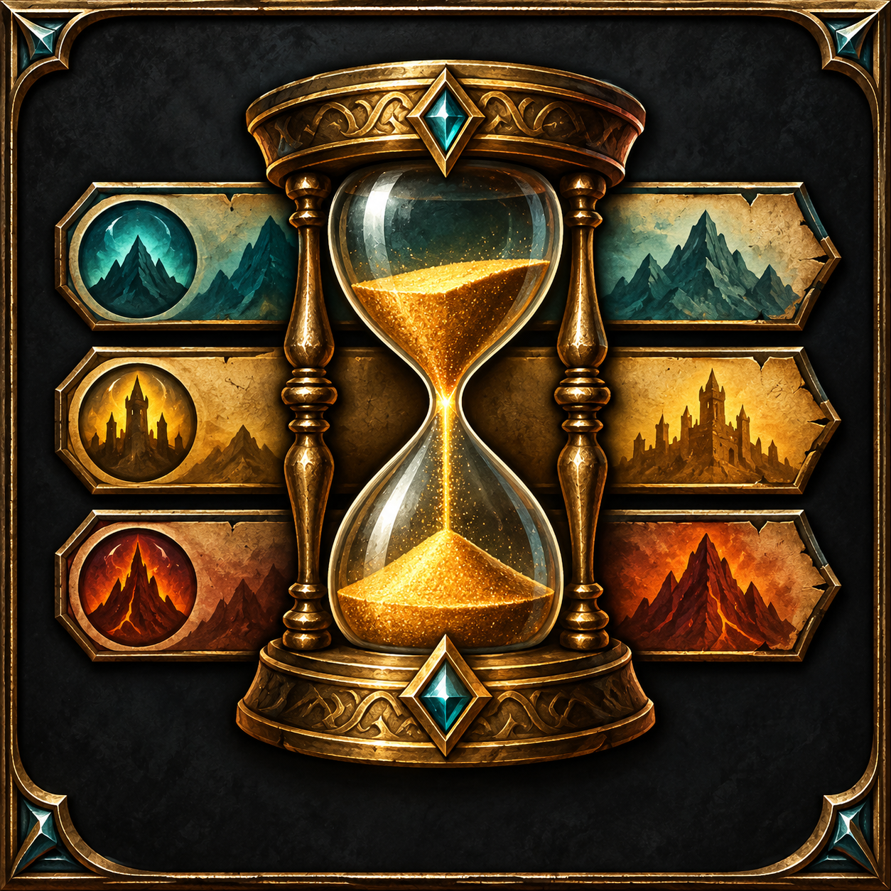

# Profession Era Bar

*Switch profession expansions with one click.*

Profession Era Bar adds a compact expansion selector beside the Professions window in **World of Warcraft Retail**. Click an era to select that expansion of your current profession. The selected era is highlighted, unlearned eras are dimmed, and the bar moves to the side of the window with available space.

[Watch the video demonstration](https://www.youtube.com/watch?v=610WMMEPQro)

## Features

- Switch profession eras directly from the **Recipes** tab.
- Use the bar on **Specializations** too. When the chosen era has a specialization tree, the window returns to Specializations; other eras open in Recipes.
- Hover an era to see its skill level and, when available, unspent specialization points.
- Hide the bar on unsupported tabs and during NPC crafting.

## Launcher controls

| Action | Result |
| --- | --- |
| Left click | Open the first primary profession's Recipes. |
| Right click | Open the second primary profession's Recipes. |
| Ctrl + left click | Lock or unlock the launcher. |
| Drag while unlocked | Move the launcher. |
| Shift + drag while unlocked | Resize the launcher. |

The launcher saves its position, size, and lock state between sessions.

## In-game screenshot

The expansion selector is the vertical row of icons immediately to the right of the Professions window. This is an unaltered in-game screenshot.

## Installation and compatibility

Install the addon through CurseForge when its release is available, or place the `ProfessionEraBar` folder in `World of Warcraft/_retail_/Interface/AddOns/` and enable it on the character selection screen.

This addon targets **World of Warcraft Retail** (Interface `120100`).

See [CHANGELOG.md](CHANGELOG.md) for release notes.
